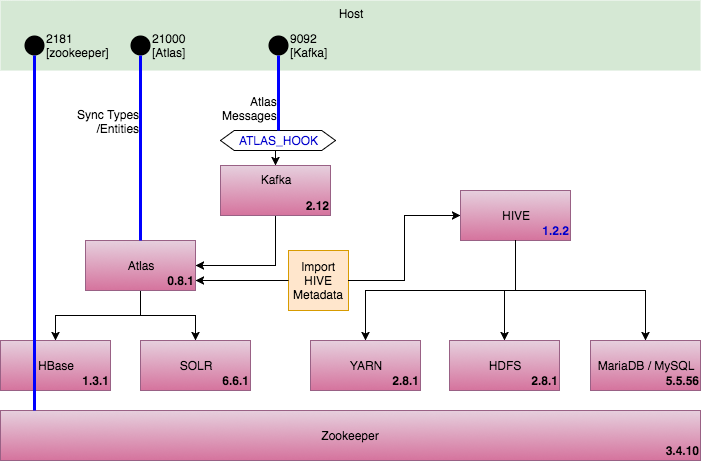
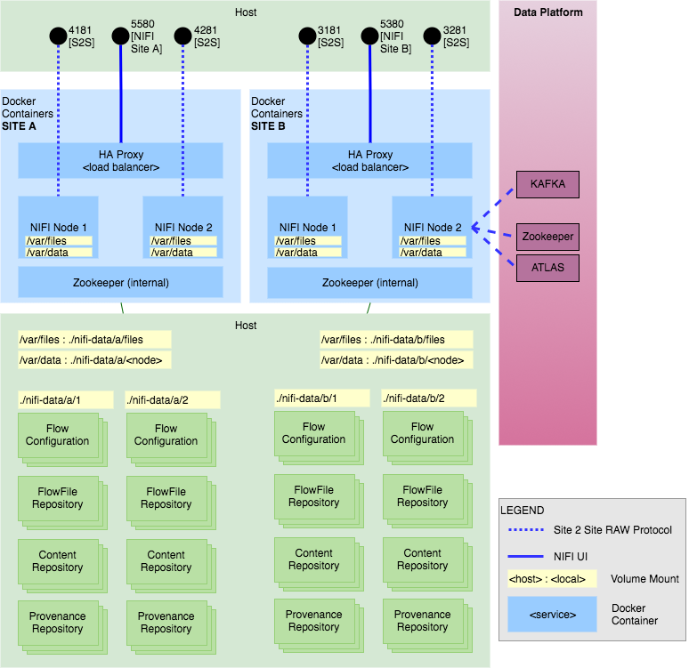

# Reference Implementation

To demonstrate the NIFI Atlas integration, a docker configuration is provided to build the following two-cluster, two-node / cluster environment.

The NIFI Cluster uses the following data platform for integrating with Atlas

NIFI Cluster:

# Services

[Atlas](http://174.138.41.167:21000/)
[NIFI Site A](http://174.138.41.167:5580/nifi/)
[NIFI Site B](http://174.138.41.167:5380/nifi/)

# Demos

## Week #1

Issues:
-------
- Excessive updates in Audit
- SelectHiveQL : Create/drop events corrupting Atlas; happens on failure
- Case sensitivity on tables and clustername
- Hive downgrade to 1.2.2 from 2.3.0; transaction handling with THRIFT
- KAFKA for events using AtlasHook
- Atlas import_hive.sh sets cluster 'primary'
- file should be a fs_path (or sub-type)
- Path strategy (lineage granularity)
- NIFI cluster naming not configured

## Week #2

Agenda:
-------
- Review NIFI multi-site setup
- Scenarios:
    - GetFile / PutFile in same cluster
    - GetFile / PutFile with remote PG
- File as fs_path

Issues:
-------
- Basic vs Advanced search in Atlas
- NIFI cluster naming
- fs_path is not updating create and modify time
- "local" remote PG causing a looping issue in Atlas

Next week:
----------
- Fix the lineage in atlas that preserves flow by time
  (qname-override, flowId tracking)
- When there is an attribute change to a processor, need to be able
  to tell what data is flowing through the new flow vs an old flow
- Only two ways to handle qname - FlowFileUuid or FlowRef.Id
    - Event Granularity? By FlowFile, By FlowPath
    - Lineage Strategy? By Processor, By FlowPath
- Push the docker cluster configuration to github
- Push nifi-atlas-bundle changes to github
- Implement Scenarios:
    - GetFile / PutFile with "local" remote PG
    - Output ports (remote PG, "local" remote PG)
    - Funnels
- fs_path is not updating create and modify time

Backlog:
--------
- NIFI cluster naming
- Excessive updates in Audit
- SelectHiveQL : Create/drop events corrupting Atlas; happens on failure
- Case sensitivity on tables and clustername
- Path strategy (lineage granularity)
- Connecting to KAFKA and Zookeeper; zookeeper should not be exposed to NIFI to connect to it

## Week #3

Agenda:
-------
- Review change to Reporter (i.e./ Strategy)
- Strategies: By File and By Path
- Using CLONE events to build the lineage; any processor can
  cause a CLONE event
- By File flow paths have reference to the Processors
- Tagging flows
- Scenarios:
    - Basic Get and Put
    - Get Put with Update
    - Get Put with Tagging
    - Single Cluster Multi-update
    - Site to site
    - S2S Multi-Update Receiver
